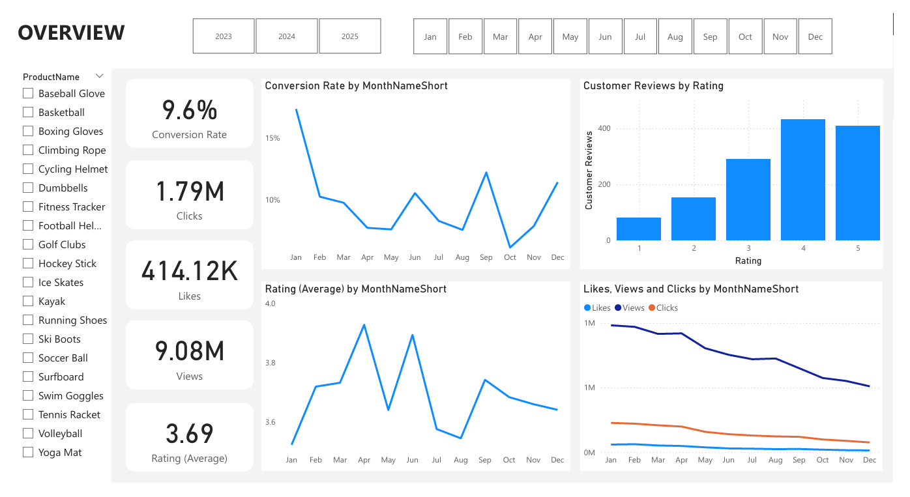
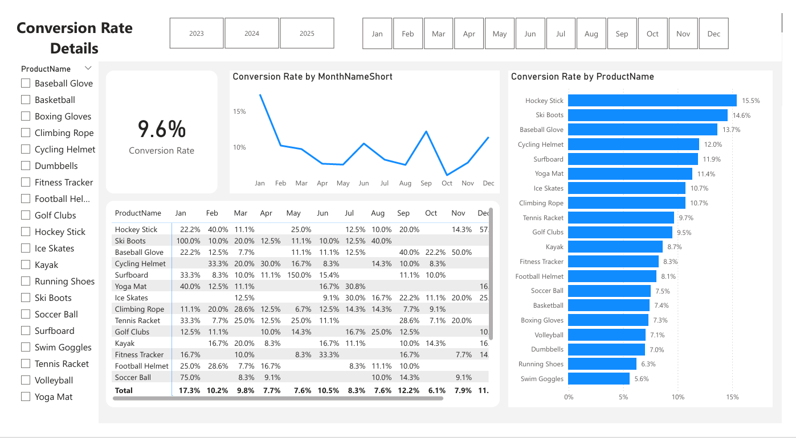
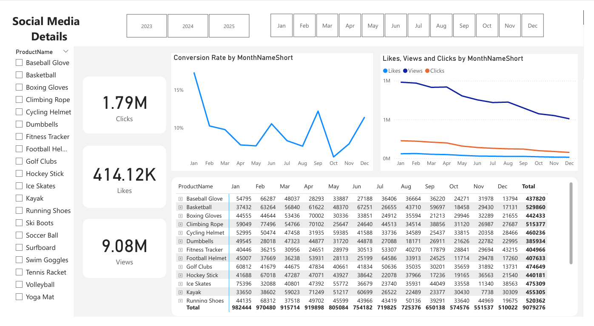
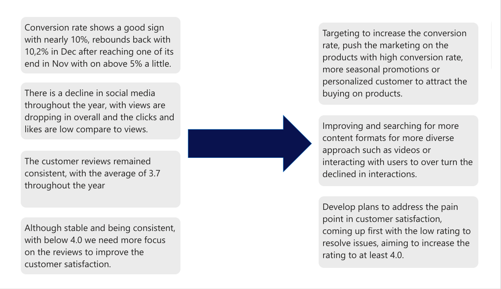

# Marketing Reviews
This is a simple project on Marketing with datasets are quite clear, we just need some clean but not much, tech using SQL Server and Power BI

# Dataset can be found in the Data folder
# Structure
- Dim_customer
- Dim_product
- Fact_customer_review
- Fact_customer_journey
- Fact_engagement_date  

# Visualization

